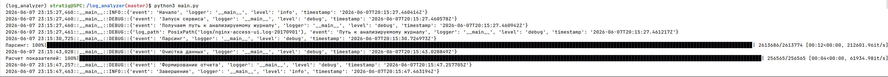

# Анализатор логов

* семпл лога: `nginx-access-ui.log-20170630.gz`
* шаблон названия логов `nginx-access-ui.log-YYYYMMDD.gz`

**Отчет**
* `url` - адрес
* `count` - сколько раз встречается URL, абсолютное значение
* `count_perc` - сколько раз встречается URL, в процентнах относительно общего числа запросов
* `time_sum` - суммарный \$request_time для данного URL'а, абсолютное значение
* `time_perc` - суммарный \$request_time для данного URL'а, в процентах относительно общего $request_time всех запросов
* `time_avg` - средний \$request_time для данного URL'а
* `time_max` - максимальный \$request_time для данного URL'а
* `time_med` - медиана \$request_time для данного URL'а

## Основная функциональность

1. Скрипт обрабатывает при запуске последний (со самой свежей датой в имени) лог в `LOG_DIR`. То есть скрипт читает лог, парсит нужные поля, рассчитывает необходимую статистику по url'ам и рендерит шаблон в `report-YYYY.MM.DD.html`, где дата в названии соответствует дате обработанного файла логов.   
2. Готовые отчеты лежат в `REPORT_DIR`. В отчет попадает `REPORT_SIZE` URL'ов с наибольшим суммарным временем обработки (`time_sum`).
3. Скрипт имеет возможность считать указанный конфиг из другого файла, передав его путь через `--config`.  
4. В переменной `config` находится конфиг по умолчанию. В конфиге, считанном из файла, могут быть переопределены перменные дефолтного конфига
5. Программа пишет структурированные логи в JSON через библиотеку [structlog]. Путь до логфайла указывается в конфиге

## Пример запуска

1. Ставим пакетный менеджер `uv`. 
2. Выполняем команду ```bash uv sync```
3. Настраиваем файл `.env` на основе `.env.example`
4. Запускаем проект python3 main.py

